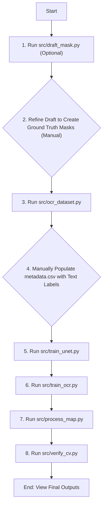

# Map Digitization

This project uses a deep learning pipeline to automatically digitize handwritten annotations from scanned map images. It performs two main tasks:
1.  **Image Segmentation**: Identifies and extracts pixel masks for handwritten boundaries and text using a fine-tuned U-Net model.
2.  **Optical Character Recognition (OCR)**: Recognizes the text within the extracted masks using a fine-tuned TrOCR model.

The final output is a GeoPackage file containing georeferenced polygons of the detected features, with the recognized text included as metadata.

    
## Setup and Installation

This project uses Conda for environment management and is designed to be run in an ephemeral cloud environment.

### Target Environment
This setup was developed and tested on a **Paperspace Gradient Notebook**. The `setup.sh` script and environment configuration are tailored for this platform. While it may work in other Debian-based Linux environments with a suitable GPU, adjustments might be necessary.

### Instructions
1.  **Clone the Repository**:
    ```bash
    git clone <your-repository-url>
    cd maps-cv
    ```

2.  **Run the Setup Script**: This script will install Miniconda (if not present) and build the project's Conda environment from the `environment.yml` file using Mamba for speed.
    ```bash
    bash setup.sh
    ```
    The installation will take several minutes the first time it is run.

3.  **Activate the Environment**: After setup is complete, you must activate the Conda environment in your terminal.
    ```bash
    conda init
    conda activate map-cv
    ```
    
## Usage Workflow
The project is designed to be run in a sequential workflow. All scripts should be run from the root of the repository after activating the Conda environment.




### Detailed Steps

1.  **Run `src/draft_mask.py` (Optional)**: This creates `draft_mask.png` in `data/input/` to serve as a starting point for your manual masks.

2.  **Refine Draft (Manual)**: This step requires a layer-based image editor like **GIMP** (free) or **Photoshop**.
    * Open the original `stockton_1.png`.
    * Import the `draft_mask.png` as a new layer.
    * Manually correct the draft by painting with pure white for features and pure black for background.
    * Export two separate files to `data/input/`: `boundaries_mask.png` and `text_mask.png`.

3.  **Run `src/create_ocr_dataset.py`**: This script uses your `text_mask.png` to generate image snippets and saves them in `data/ocr_data/images/`.

4.  **Populate `metadata.csv` (Manual)**: Create a text file at `data/ocr_data/metadata.csv`. It must contain two columns, `file_name` and `text`, with the correct label for each image snippet generated in the previous step.

    **Example `metadata.csv` format:**
    ```csv
    file_name,text
    images/image_0.png,"W/1098"
    images/image_1.png,"96/0999"
    images/image_2.png,"SK/5581P"
    ```
5.  **Train Models**: Run `src/train_segmentation.py` and `src/train_ocr.py`.
6.  **Run Inference**: Run `src/process_map.py` to generate the final `GeoPackage`.
7.  **Verify Output**: Run `src/verify_output.py` to create a final annotated image.

    
## Scripts Description

All executable scripts are located in the `src/` directory.

* `draft_mask.py`: A utility to programmatically generate a draft mask for manual refinement.
* `create_ocr_dataset.py`: Extracts text image snippets from the ground truth text mask to prepare data for OCR training.
* `train_segmentation.py`: Trains the fine-tuned U-Net segmentation model.
* `train_ocr.py`: Fine-tunes the TrOCR model for handwriting recognition.
* `process_map.py`: The main inference script that runs the full pipeline on a source image to generate the final GeoPackage.
* `verify_cv.py`: A utility to programmatically verify the final geospatial output by creating an annotated image.
  
    
    